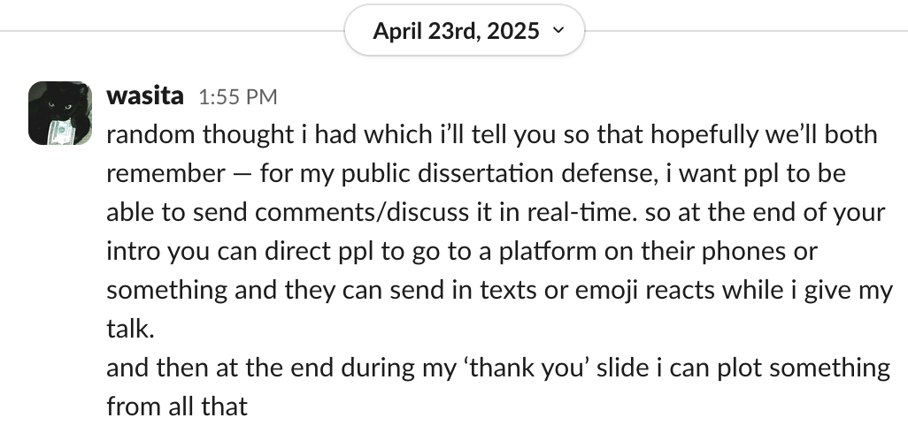
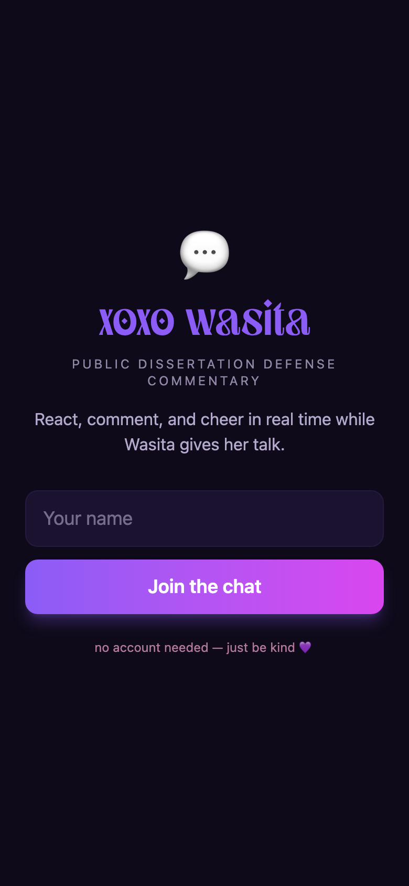
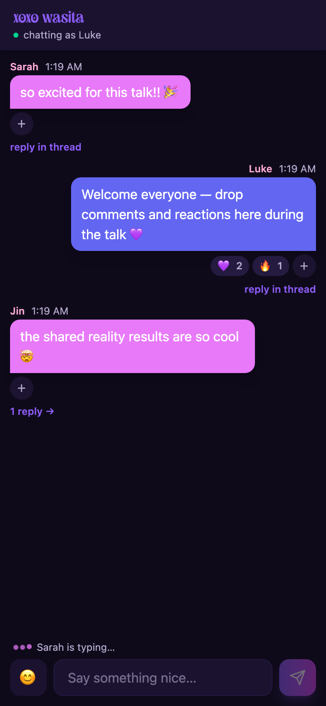
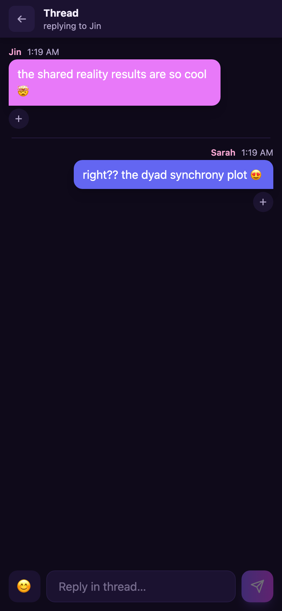

# xoxo wasita 💜

Real-time audience commentary for [Wasita Mahaphanit](https://wasita.space)'s
public dissertation defense. The audience goes to **[xoxowasita.com](https://xoxowasita.com)**
on their phones, types a name (no account), and comments, emoji-reacts, and
threads in real time while she talks. Everything persists, so the chat itself
becomes data — to be plotted live on her "thank you" slide.

## Why this exists

Wasita called this shot fourteen months ago:



This is that platform — built the way she would have built it. Wasita writes
serverless real-time chat apps in Svelte on Firebase
([shared-reality-chat](https://github.com/cosanlab/shared-reality-chat),
[survivor-chat](https://github.com/cosanlab/survivor-chat)), so her defense
chat is one too: same stack, same message-bubble design language, same 500 ms
typing-indicator debounce, her violet/fuchsia/pink palette in dark mode, and
the wordmark set in Monas, the display face from her personal site.

## Screenshots

| Join | Room | Thread |
|------|------|--------|
|  |  |  |

## Features

- **Zero-friction join** — name only, kept in `localStorage`; refresh doesn't re-prompt
- **Slack-style threads** — reply counts on parents, slide-over thread panel
- **Emoji reactions** — tap to toggle; counts update live for everyone
- **Typing indicators** — "Sarah is typing…" / "3 people are typing…" with
  bouncing dots, scoped per room *and* per thread
- **Feels instant** — optimistic sends, streamed `child_added` updates, pinned
  autoscroll with a "↓ new messages" pill, reconnect indicator, iOS safe-area
  aware composer
- **Serverless** — the browser talks straight to Firebase Realtime Database;
  security is enforced by database rules, not a backend

## Architecture

Svelte 5 (runes) + Vite + Tailwind CSS v4, deployed on Firebase Hosting.

```
/messages/{pushId}:  { name, text, ts, parentId? }   # parentId ⇒ thread reply
/reactions/{msgId}/{emoji}/{clientId}: name
/typing/{scope}/{clientId}: { name, ts }             # scope = "main" | msgId
```

The client subscribes to `/messages` once and derives every view (main list,
per-parent threads, reply counts) from that single stream — a few hundred
messages at defense scale, so pure functions beat clever queries
(`src/lib/derive.js`, unit-tested). Database rules make `/messages`
**append-only** with shape validation (name ≤ 30 chars, text ≤ 500, no extra
fields), so nobody can edit or delete anyone's words; typing state cleans
itself up via `onDisconnect`.

## Develop / test / deploy

```bash
npm install
npm run dev          # local dev against the live database
npm test             # Vitest unit tests (identity, derivations)
npm run e2e          # Playwright 2-user smoke test: send, react, thread, typing
BASE_URL=https://xoxowasita.com npm run e2e    # same test against prod

npm run build && npx firebase deploy   # hosting + database rules
```

Firebase web config goes in `.env.local` (see `.env.example`; values from
`npx firebase apps:sdkconfig web`). It's not secret — security lives in
`database.rules.json` — it's just kept out of the repo so forks can point at
their own project.

## Event-day runbook

1. **Before the talk:** `./scripts/reset_chat.sh` wipes test chatter
   (`./scripts/export_chat.sh` first if you want to keep it).
2. Put **xoxowasita.com** on the intro slide.
3. **After:** `./scripts/export_chat.sh` → one JSON with every message,
   author, millisecond timestamp, thread parent, and reaction — ready for
   the thank-you-slide plot. Both scripts authenticate via `gcloud` as the
   project owner.

## Custom domain

`xoxowasita.com` and `www.xoxowasita.com` are registered with Firebase Hosting.
DNS at the registrar:

| Type  | Host  | Value |
|-------|-------|-------|
| TXT   | `@`   | `hosting-site=wasita-defense-chat` |
| A     | `@`   | `199.36.158.100` |
| CNAME | `www` | `wasita-defense-chat.web.app` |

TLS provisions automatically once DNS propagates. The underlying
https://wasita-defense-chat.web.app always works as a fallback.

## License

[MIT](LICENSE) — with love, for Wasita's defense. 🐙

Design spec and implementation plan live in `docs/superpowers/`.
